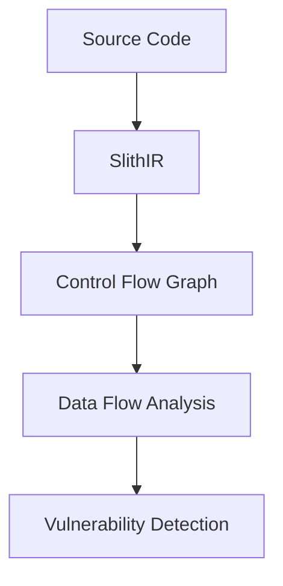

# Slither: Comprehensive Smart Contract Analysis Tool
*Created: November 10, 2024*
*Author: Technical Documentation Team*

## Table of Contents
1. [Introduction](#introduction)
2. [Installation and Setup](#installation-and-setup)
3. [Core Features](#core-features)
4. [Detectors in Detail](#detectors-in-detail)
5. [Advanced Usage](#advanced-usage)
6. [Integration Guide](#integration-guide)
7. [References](#references)

## Introduction
Slither is a static analysis framework designed to find smart contract vulnerabilities, optimize gas usage, and enforce best practices. Developed by Trail of Bits, it provides extensive analysis capabilities through its modular architecture.

## Installation and Setup

### Basic Installation
```bash
# Using pip
pip install slither-analyzer

# Using docker
docker pull trailofbits/eth-security-toolbox
```

### Development Setup
```bash
git clone https://github.com/crytic/slither
cd slither
python setup.py install
```

### Configuration File
```json
{
    "filter_paths": "node_modules",
    "exclude_informational": true,
    "exclude_low": false,
    "exclude_medium": false,
    "exclude_high": false,
    "disable_color": false,
    "filter_paths": "test",
    "legacy_ast": false
}
```

## Core Features

### 1. Vulnerability Detection System

#### Built-in Detectors
```python
# Example custom detector
from slither.detectors.abstract_detector import AbstractDetector
from slither.core.declarations import Function

class CustomDetector(AbstractDetector):
    ARGUMENT = "custom"
    HELP = "Custom vulnerability detector"
    IMPACT = "High"
    CONFIDENCE = "Medium"

    def detect(self):
        results = []
        for contract in self.compilation_unit.contracts_derived:
            # Detection logic
            pass
        return results
```

### 2. Code Property Graphs



### 3. Analysis Capabilities

#### Control Flow Analysis
```solidity
// Example of control flow analysis
contract Example {
    function complexFunction(uint x) public {
        // Slither analyzes paths:
        if (x > 0) {
            // Path 1
            doSomething();
        } else {
            // Path 2
            doSomethingElse();
        }
    }
}
```

## Detectors in Detail

### 1. Reentrancy Detector

#### Implementation
```solidity
// Vulnerable to reentrancy
contract Vulnerable {
    mapping(address => uint) balances;

    function withdraw() public {
        uint balance = balances[msg.sender];
        require(balance > 0);
        (bool success, ) = msg.sender.call{value: balance}("");
        require(success);
        balances[msg.sender] = 0;
    }
}
```

#### Detection Logic
```python
def detect_reentrancy(contract):
    for function in contract.functions:
        for call in function.external_calls:
            if call.is_external_call:
                if has_state_change_after_call(function, call):
                    return True
    return False
```

### 2. Uninitialized Variables

#### Example
```solidity
contract Uninit {
    struct Data {
        uint value;
        address owner;
    }
    
    Data[] items;
    
    function dangerous() public {
        Data item;  // Uninitialized storage reference
        item.value = 100;  // Modifies storage slot 0
    }
}
```

### 3. Constant Function Detection

```solidity
contract ConstantFunctions {
    uint public value;
    
    // Should be marked view
    function getValue() public {
        return value;
    }
}
```

## Advanced Usage

### 1. Custom Printer Development
```python
from slither.printers.abstract_printer import AbstractPrinter

class CustomPrinter(AbstractPrinter):
    ARGUMENT = "custom-print"
    HELP = "Custom analysis printer"

    def output(self, filename):
        info = []
        for contract in self.contracts:
            # Custom analysis logic
            pass
        self.info(info)
```

### 2. API Integration
```python
from slither import Slither

# Initialize Slither
slither = Slither('contract.sol')

# Access compilation units
compilation_unit = slither.compilation_unit

# Analyze contracts
for contract in slither.contracts:
    print(f"Contract: {contract.name}")
    for function in contract.functions:
        print(f"Function: {function.name}")
```

### 3. CI/CD Integration

#### GitHub Actions
```yaml
name: Slither Analysis
on: [push]
jobs:
  analyze:
    runs-on: ubuntu-latest
    steps:
      - uses: actions/checkout@v2
      - name: Run Slither
        uses: crytic/slither-action@v0.1.1
        with:
          node-version: 16
          sarif: results.sarif
```

#### GitLab CI
```yaml
slither:
  image: trailofbits/eth-security-toolbox
  script:
    - slither .
  artifacts:
    reports:
      junit: slither-report.xml
```

## Best Practices

### 1. Analysis Configuration
- Use project-specific configurations
- Exclude test files
- Configure appropriate severity levels
- Document false positives

### 2. Result Handling
```python
# Example result processing
def process_slither_results(results):
    critical = []
    high = []
    medium = []
    low = []
    
    for result in results:
        if result.impact == 'Critical':
            critical.append(result)
        elif result.impact == 'High':
            high.append(result)
        # ... etc
```

### 3. Performance Optimization
- Use incremental analysis
- Configure appropriate filters
- Optimize detector selection
- Cache analysis results

## References
1. Trail of Bits Official Documentation
2. Slither GitHub Repository
3. Ethereum Smart Contract Best Practices
4. Academic Papers on Static Analysis
5. Security Tool Comparison Studies

---
*Note: This document is for educational purposes. Always perform thorough security audits for production code.*
