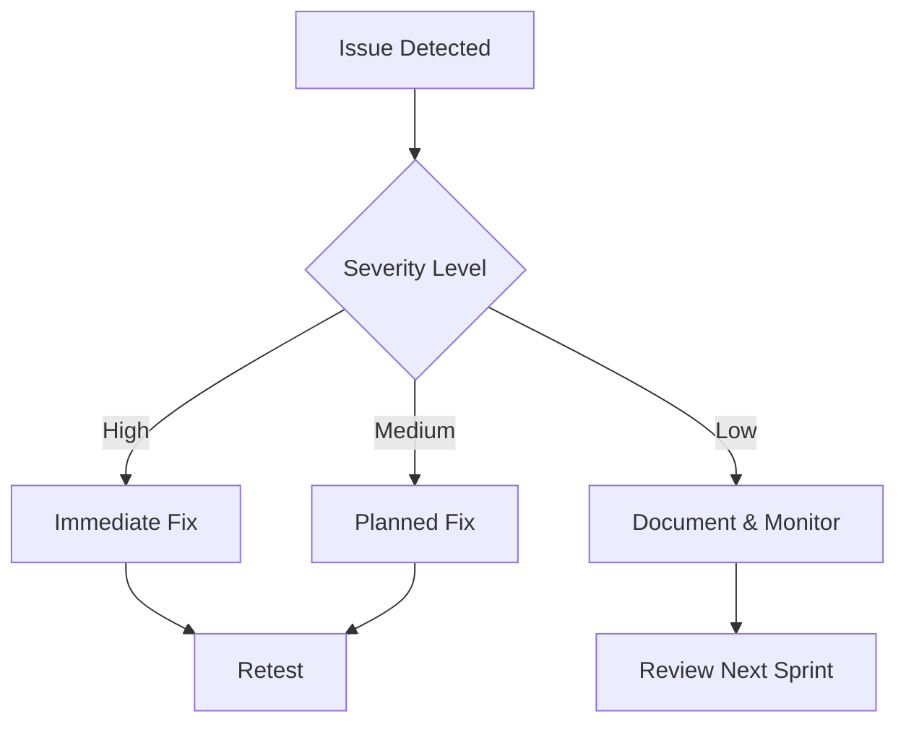

# Static Analysis Tools for Smart Contract Security
*Created: November 10, 2024*
*Author: Technical Documentation Team*

## Table of Contents
1. [Introduction](#introduction)
2. [Types of Static Analysis Tools](#types-of-static-analysis-tools)
3. [Popular Tools Overview](#popular-tools-overview)
4. [Integration in Development Workflow](#integration-in-development-workflow)
5. [Best Practices](#best-practices)
6. [References](#references)

## Introduction
Static analysis tools examine smart contract code without executing it, identifying potential vulnerabilities and code quality issues during the development phase. These tools are essential components of the smart contract security audit process.

## Types of Static Analysis Tools

### 1. Linters
- **Purpose**: Check code style and enforce conventions
- **Examples**: Solhint, ESLint-plugin-solidity
- **Key Features**:
  - Style guide enforcement
  - Basic syntax checking
  - Code formatting rules
  - Best practice suggestions

### 2. Security Scanners
- **Purpose**: Identify security vulnerabilities
- **Examples**: Slither, Mythril, Securify
- **Key Features**:
  - Vulnerability detection
  - Control flow analysis
  - Data flow analysis
  - Pattern matching

### 3. Gas Optimizers
- **Purpose**: Improve contract efficiency
- **Examples**: Gas-opt tools in Mythril, Slither
- **Key Features**:
  - Gas usage analysis
  - Optimization suggestions
  - Cost estimation

## Popular Tools Overview

### 1. Slither
- **Developer**: Trail of Bits
- **Key Features**:
  - 50+ built-in vulnerability detectors
  - Custom analysis framework
  - Python API for extensions
  - CI/CD integration
- **Best For**: Comprehensive static analysis

### 2. Mythril
- **Developer**: ConsenSys
- **Key Features**:
  - Symbolic execution
  - Constraint solving
  - Security analysis
  - Module system
- **Best For**: Deep vulnerability analysis

### 3. Securify
- **Developer**: ChainSecurity
- **Key Features**:
  - Formal verification
  - Security patterns
  - Automated proof generation
- **Best For**: Formal security verification

### 4. Solhint
- **Developer**: Community maintained
- **Key Features**:
  - Style guide enforcement
  - Security best practices
  - Plugin system
- **Best For**: Code style and basic security

## Integration in Development Workflow

### 1. Local Development
```bash
# Example pre-commit hook
#!/bin/bash
solhint "contracts/**/*.sol"
slither .
mythril analyze contracts/Contract.sol
```

### 2. CI/CD Integration
```yaml
# GitHub Actions example
name: Smart Contract Analysis
on: [push]
jobs:
  analyze:
    runs-on: ubuntu-latest
    steps:
      - uses: actions/checkout@v2
      - name: Run Slither
        uses: crytic/slither-action@v0.1.1
      - name: Run Mythril
        uses: mythril-security/mythril-action@v1
```

### 3. VSCode Integration
```json
{
  "solidity.linter": "solhint",
  "solidity.enabledAsYouTypeCompilationErrorCheck": true,
  "solidity.validationDelay": 1500
}
```

## Best Practices

### 1. Tool Selection
- Use multiple complementary tools
- Consider project size and complexity
- Balance thoroughness with speed
- Evaluate false positive rates

### 2. Configuration
- Customize for project needs
- Document exceptions
- Version control configurations
- Regular updates

### 3. Response Strategy


### 4. Common Issues to Check
1. **Security**
   - Reentrancy
   - Integer overflow
   - Access control
   - Timestamp dependence

2. **Gas Optimization**
   - Storage patterns
   - Loop optimization
   - Function visibility
   - Variable packing

3. **Code Quality**
   - Naming conventions
   - Documentation
   - Test coverage
   - Code complexity

## Tooling Matrix

| Tool | Security | Style | Gas | CI/CD | Speed |
|------|----------|-------|-----|-------|-------|
| Slither | ★★★★★ | ★★★ | ★★★★ | ★★★★★ | Fast |
| Mythril | ★★★★★ | ★ | ★★★ | ★★★ | Slow |
| Securify | ★★★★ | ★★ | ★★ | ★★★ | Medium |
| Solhint | ★★ | ★★★★★ | ★ | ★★★★★ | Fast |

## References
1. Ethereum Smart Contract Security Best Practices
2. Trail of Bits Engineering Blog
3. ConsenSys Security Best Practices
4. OpenZeppelin Security Guidelines
5. Ethereum Foundation Security Resources

---
*Note: This document is for educational purposes. Always perform thorough security audits for production code.*
