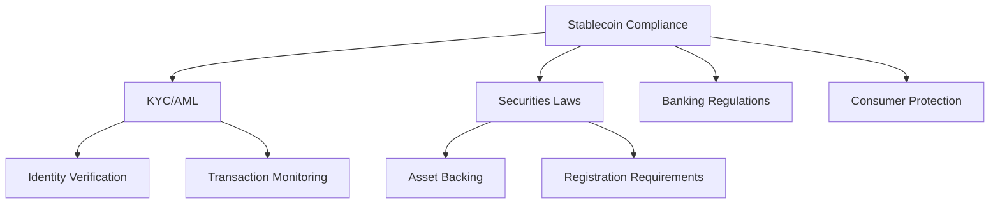

# Stablecoin Development Study Guide
> Topic: Compliance and Regulatory Considerations  
> Last Updated: November 2024  
> Category: Blockchain Engineering  

## Table of Contents
1. [Introduction](#introduction)
2. [Core Concepts](#core-concepts)
3. [Technical Implementation](#technical-implementation)
4. [Best Practices](#best-practices)
5. [Interview Preparation](#interview-preparation)
6. [References](#references)

## Introduction
This study guide covers the essential aspects of compliance and regulatory considerations in stablecoin development, focusing on practical implementation and interview preparation.

## Core Concepts

### Regulatory Framework Overview


### Key Compliance Requirements
1. **KYC/AML Compliance**
   - Identity verification
   - Transaction monitoring
   - Suspicious activity reporting

2. **Reserve Requirements**
   - Asset backing verification
   - Regular audits
   - Transparent reporting

3. **Operational Controls**
   - Multi-signature operations
   - Emergency procedures
   - Upgrade mechanisms

## Technical Implementation

### Smart Contract Architecture
```solidity
// SPDX-License-Identifier: MIT
pragma solidity ^0.8.0;

/**
 * @title CompliantStablecoin
 * @dev Implementation of a compliant stablecoin with regulatory features
 * @notice This contract implements basic compliance features required by regulators
 */
contract CompliantStablecoin is ERC20, Pausable, AccessControl {
    // Role definitions
    bytes32 public constant COMPLIANCE_ROLE = keccak256("COMPLIANCE_ROLE");
    bytes32 public constant UPGRADER_ROLE = keccak256("UPGRADER_ROLE");
    
    // Compliance state variables
    mapping(address => bool) public blacklist;
    mapping(address => bool) public kycApproved;
    
    // Events for compliance tracking
    event AddressBlacklisted(address indexed account, address indexed operator);
    event KYCApproved(address indexed account, address indexed operator);
    
    /**
     * @dev Constructor sets up initial roles and parameters
     * @param admin Address of the initial admin
     */
    constructor(address admin) ERC20("Compliant Stablecoin", "CUSD") {
        _setupRole(DEFAULT_ADMIN_ROLE, admin);
        _setupRole(COMPLIANCE_ROLE, admin);
    }
    
    // --- Compliance Functions ---
    
    /**
     * @dev Blacklist an address
     * @param account Address to blacklist
     */
    function blacklistAddress(address account) 
        external 
        onlyRole(COMPLIANCE_ROLE) 
    {
        blacklist[account] = true;
        emit AddressBlacklisted(account, msg.sender);
    }
    
    /**
     * @dev Approve KYC for an address
     * @param account Address to approve
     */
    function approveKYC(address account) 
        external 
        onlyRole(COMPLIANCE_ROLE) 
    {
        kycApproved[account] = true;
        emit KYCApproved(account, msg.sender);
    }
    
    // --- Override Transfer Functions ---
    
    /**
     * @dev Override transfer function to include compliance checks
     */
    function transfer(address to, uint256 amount) 
        public 
        virtual 
        override 
        whenNotPaused 
        returns (bool) 
    {
        require(!blacklist[msg.sender] && !blacklist[to], "Address blacklisted");
        require(kycApproved[msg.sender] && kycApproved[to], "KYC not approved");
        return super.transfer(to, amount);
    }
}
```

### Implementation Notes
- Use OpenZeppelin's security contracts as foundation
- Implement upgradeable patterns for future regulatory changes
- Include comprehensive event logging for compliance tracking

## Best Practices

### Security Considerations
1. Regular security audits
2. Multi-signature requirements for critical functions
3. Emergency pause mechanisms
4. Rate limiting for large transactions

### Compliance Documentation
- Maintain detailed compliance procedures
- Document all regulatory requirements
- Keep upgrade history
- Track all compliance-related events

## Interview Preparation

### Common Technical Questions
1. "How would you implement a secure upgrade mechanism for compliance features?"
   ```solidity
   // Example implementation using transparent proxy pattern
   function upgrade(address newImplementation) 
       external 
       onlyRole(UPGRADER_ROLE) 
   {
       require(newImplementation != address(0), "Invalid implementation");
       _updateImplementation(newImplementation);
   }
   ```

2. "Explain your approach to handling cross-border transactions with different regulatory requirements?"
   - Implementation should consider:
     * Jurisdiction detection
     * Rule engine for compliance
     * Transaction routing logic

### System Design Questions
1. Design a scalable compliance monitoring system
2. Implement real-time transaction screening
3. Create an upgradeable regulatory framework

## References

### Standards
1. EIP-3009: Transfer with Authorization
2. EIP-2612: Permit Extension
3. OpenZeppelin Contracts v4.8.0

### Regulatory Guidelines
1. FATF Guidelines for Virtual Assets
2. FinCEN Guidance on Virtual Currencies
3. SEC Framework for Investment Contract Analysis

### Industry Examples
1. USDC Implementation
2. Paxos Standard
3. BUSD Architecture

---
*Note: This document is for study purposes only and should be validated against current regulatory requirements.*
